# Stuman

Hello! Geeky friends I am Ajay who is a UI/UX web developer Enthusiast.
<b>STUMAN</b> is a shortform for student's manager in which every user can store student detail's. This web app helps in 
filtering the students based on department, year, semester etc. This web app stores every details such as firstname, lastname
 , email etc and account details which is optional.
 
The main focus of this app is to reduce the difficulties faced by the user to store student details and helps in hospitality
 in which every user can get the details of the student for a respective blood. We also provide exporting details
 such as export to word , export to excel . We also provides filtered export in which every user can get the documents 
 of particular students based on the filter.
 
## MISSION: 
Our mission is to safeguard the patient in the hospital for the purpose immediate blood donors and to walk away
 the difficulties of maintaining students details in academy.
 
## VISION:
Our vision is to make new web apps based on this app inorder to focus in colleges as well as schools, railway 
, bustand ,airway , IIT, NIT and for the purpose of E-Commerce

#Technology
Guys I have used Spring MVC which is a sub source of SPRING-BOOT , Hibernate JPA for database Integrity and PostgreSQL as 
database. This app is also pay attension to mobile users as i have designed this web app using front technology like <b>HTML</b>
, <b>CSS</b>, <b>BOOTSTRAP</b> and <b>JQUERY</b>. I have attached the APK in the navigation bar desciption.

### Test Link
<a href="http://stumankce.herokuapp.com">Click Here</a>

Test Username : <b>ajay102</b>

Test Password : <b>AJAYajay123!</b>

## Screen Shots

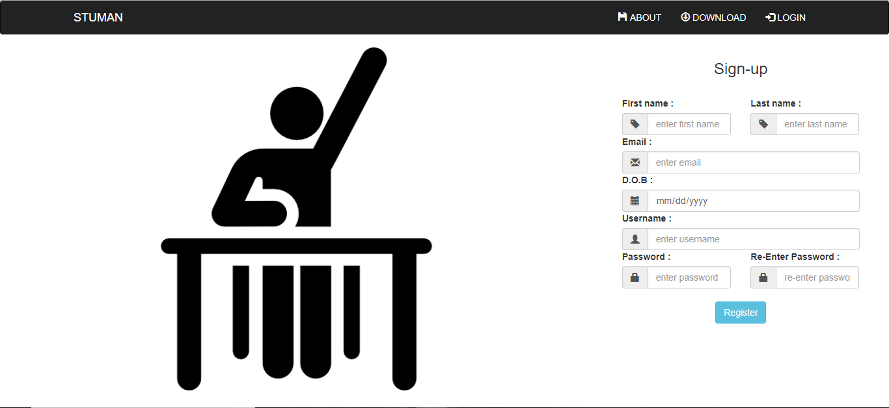
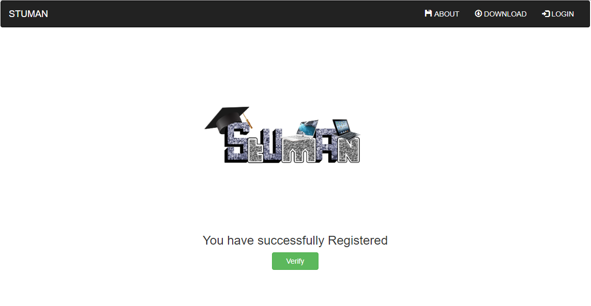
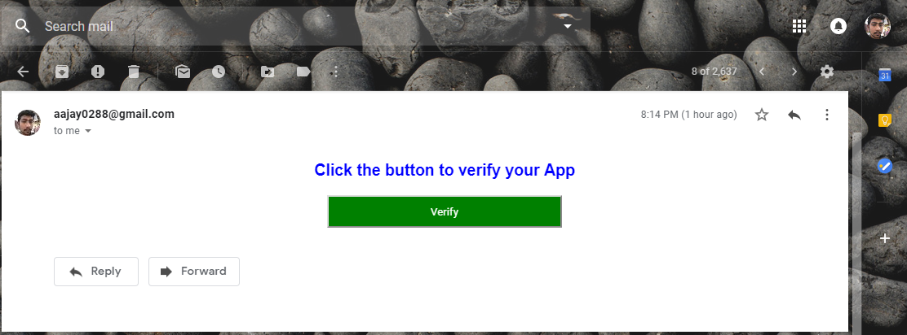
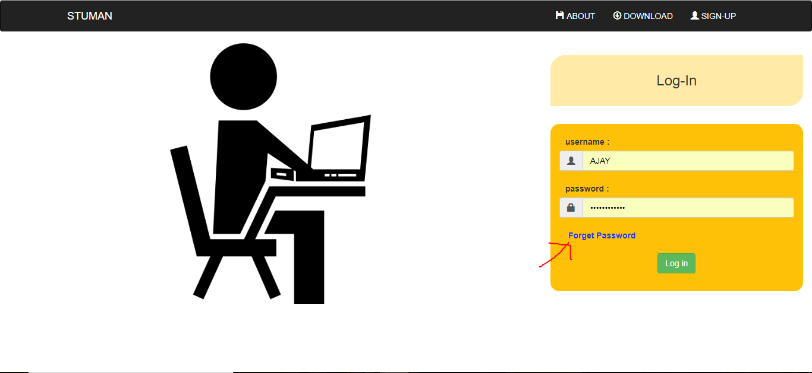
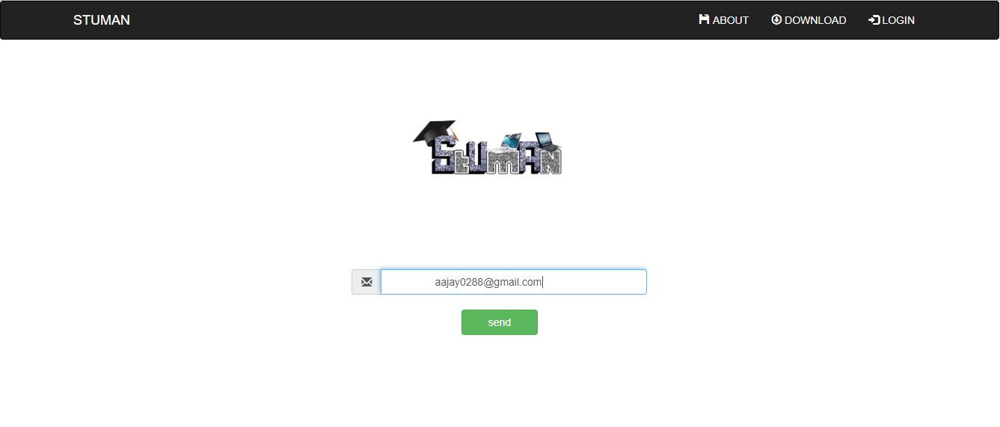
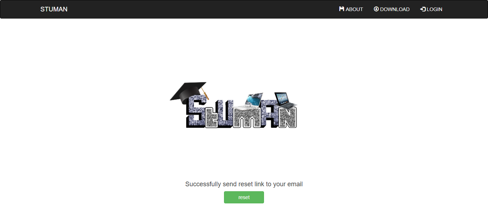
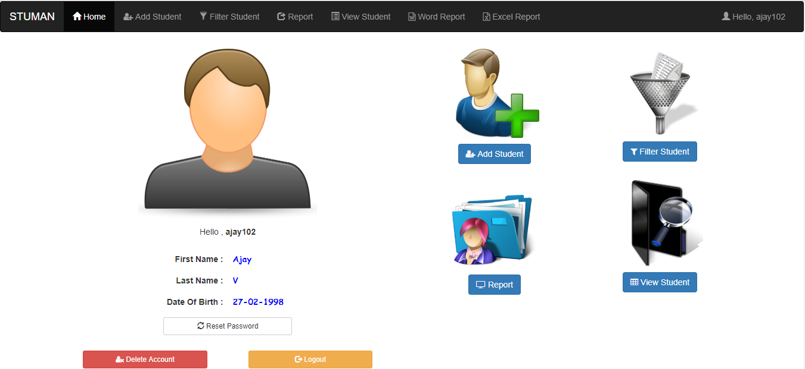

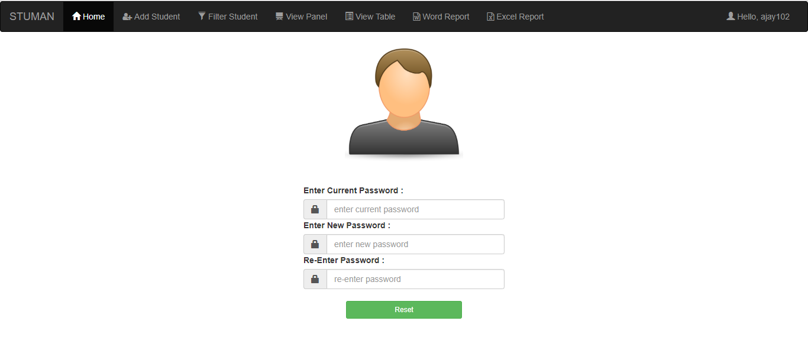
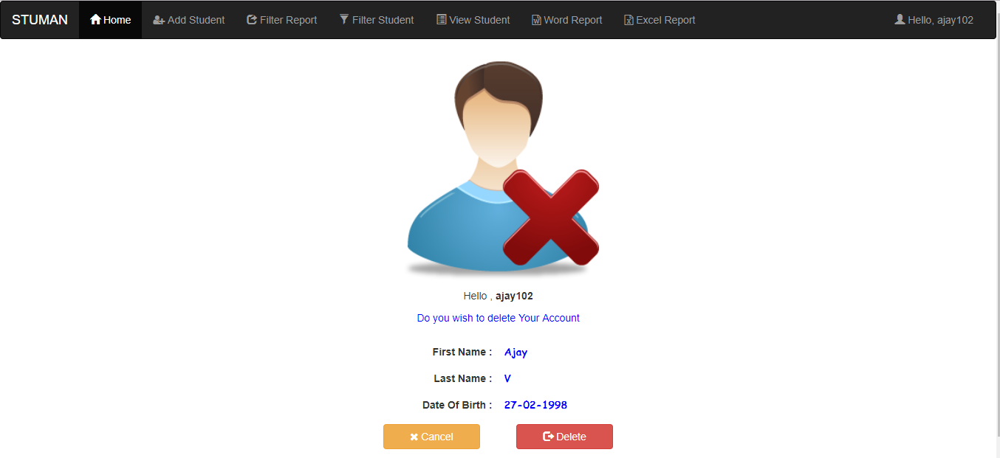
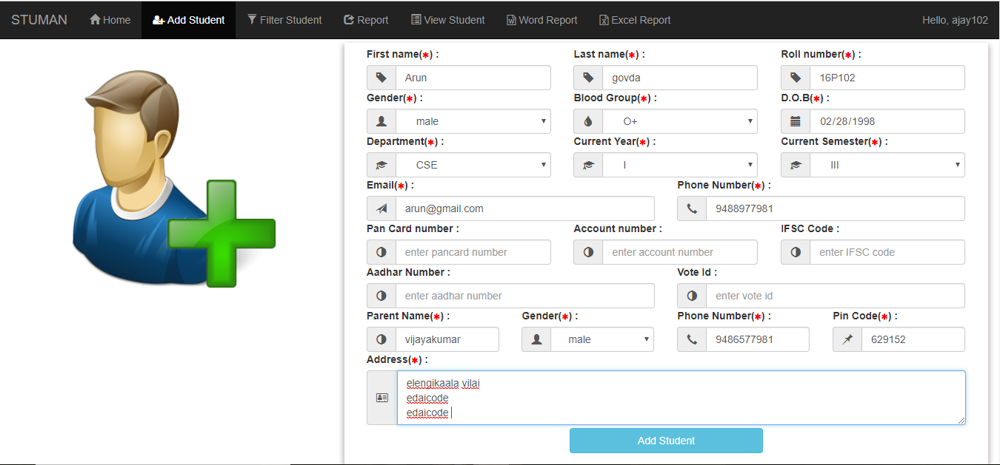
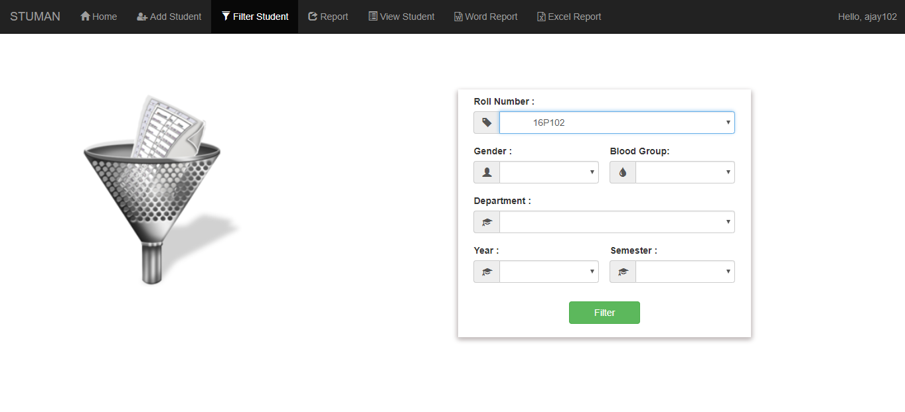
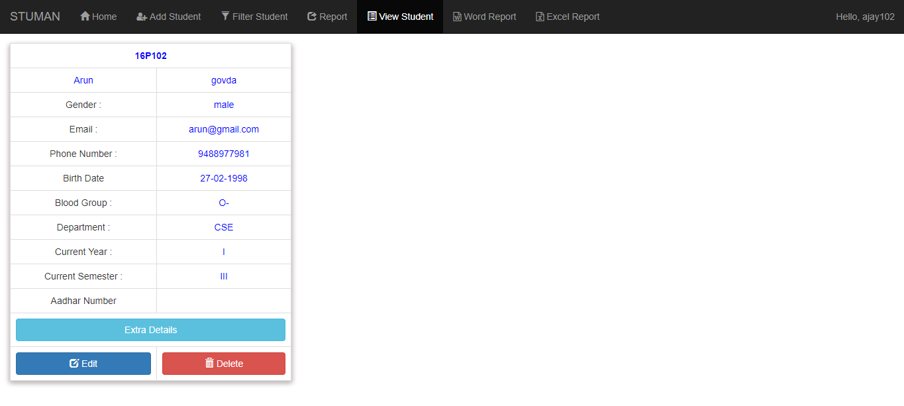
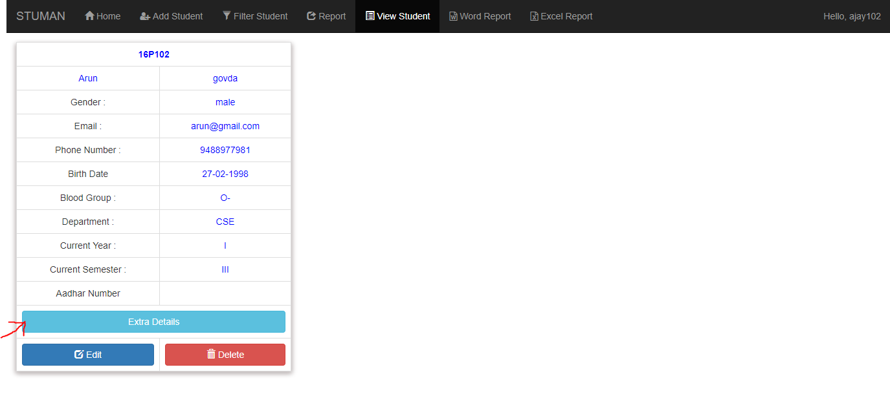
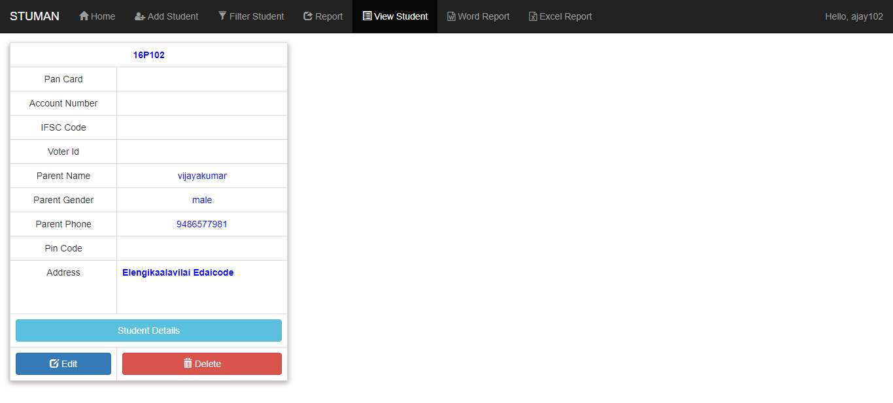
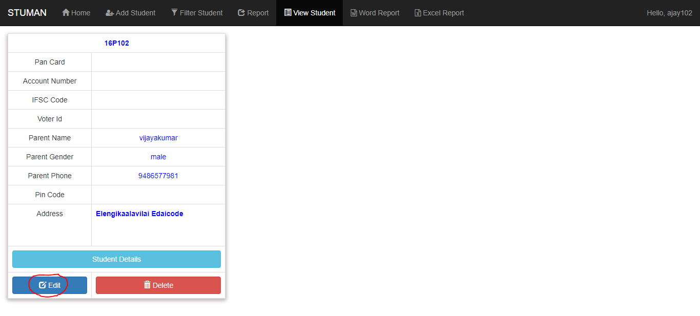
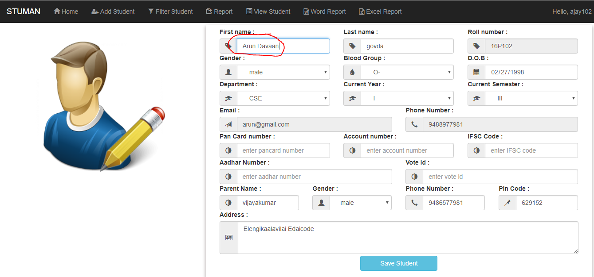
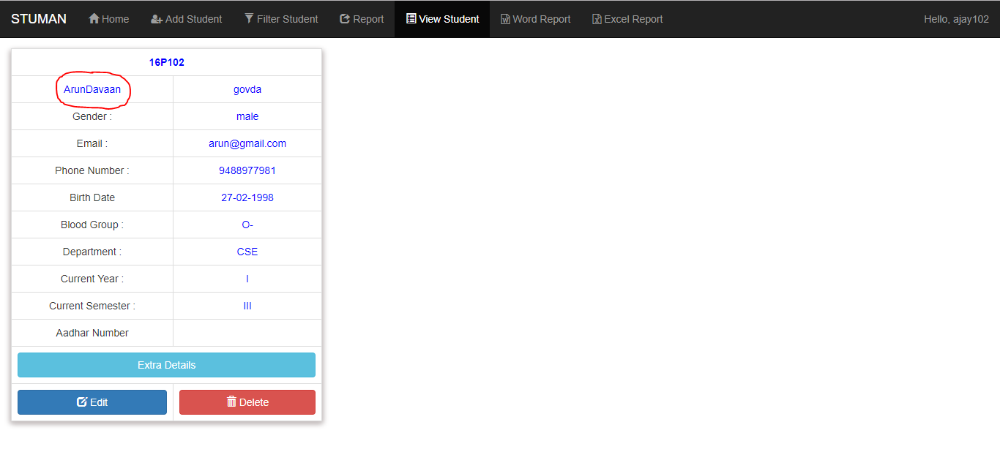
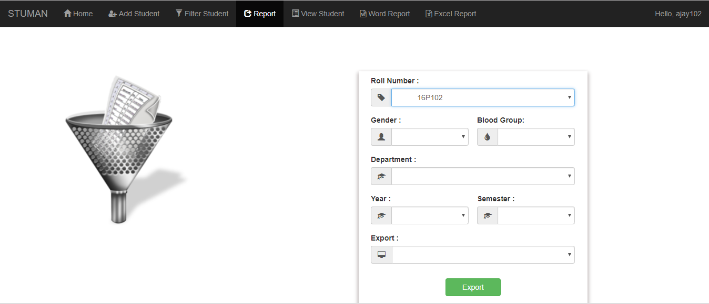
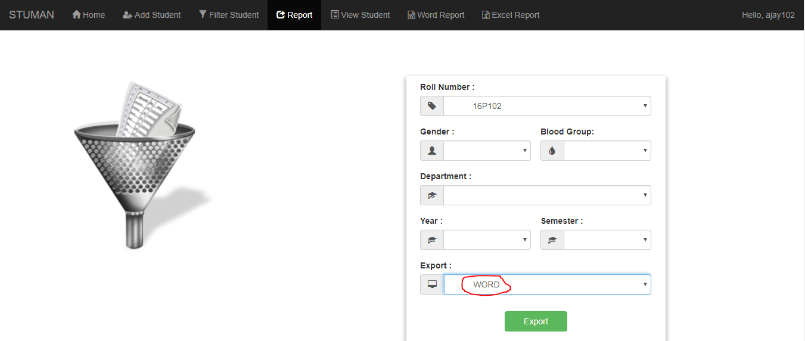
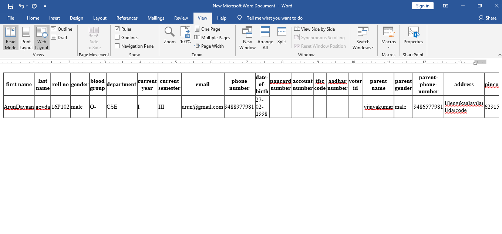
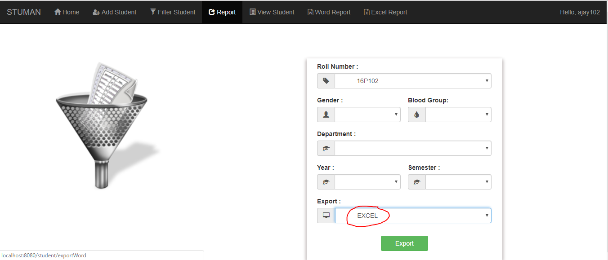
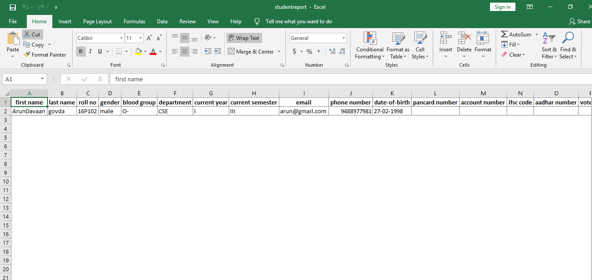

 
